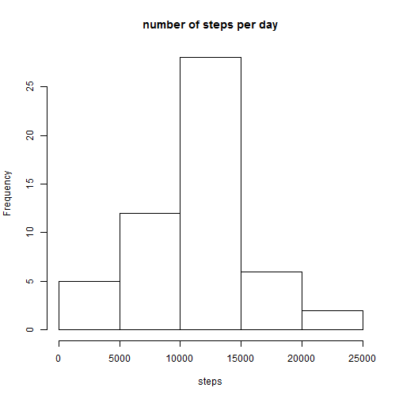
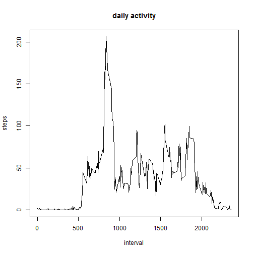
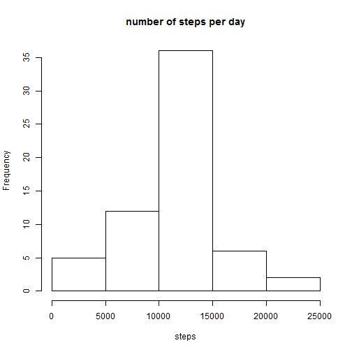
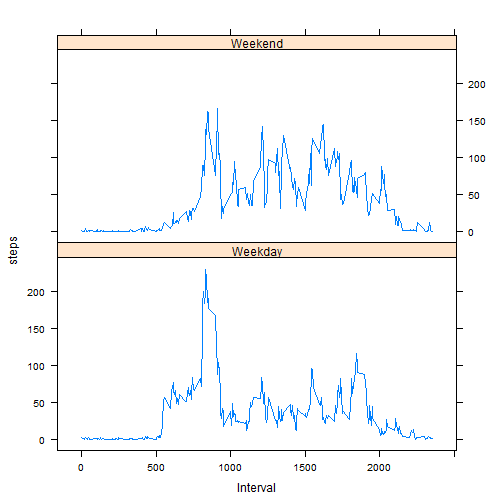

## Loading and preprocessing the data

```r
# unzip and read the activity file, its assumed its in the working directory
act <- read.csv(unz("activity.zip", "activity.csv"), sep=",", stringsAsFactors = FALSE)
act$date <- as.Date(act$date)
```

## What is mean total number of steps taken per day?


```r
# steps to make a histogram
act.date <- aggregate(steps~date, data=act,FUN=sum)
hist(act.date$steps, xlab="steps", main="number of steps per day")
```

 

```r
# steps to calculate the mean and median
mean(act.date$steps)
```

```
## [1] 10766.19
```

```r
median(act.date$steps)
```

```
## [1] 10765
```


## What is the average daily activity pattern?

```r
# aggregate mean steps by interval and make the time series plot
act.interval <- aggregate(steps~interval, data=act, FUN=mean)
plot(act.interval$interval, act.interval$steps, type="l", xlab="interval", ylab="steps", main="daily activity")
```

 

```r
# the biggest spike is at :
act.interval$interval[which.max(act.interval$steps)]
```

```
## [1] 835
```


## Imputing missing values

```r
# number of missing values
sum(is.na(act))
```

```
## [1] 2304
```

```r
# strategy to assign values to NA. A good assumption to use is that the number of steps follows a daily pattern
# that is close to even across all the days, so the average of recorded values for the same interval can be
# assigned to the NAs
act2 <- act
act2$steps <- mapply(function(steps, interval) 
                        if (is.na(steps)) 
                                act.interval[act.interval$interval == interval, 2]
                        else
                                steps,
                     act2$steps, act2$interval)

# use new dataframe to show histogram of steps per day
act2.date <- aggregate(steps~date, data=act2, FUN=sum)
hist(act2.date$steps, xlab="steps", main="number of steps per day")
```

 

```r
# mean and median
mean(act2.date$steps)
```

```
## [1] 10766.19
```

```r
median(act2.date$steps)
```

```
## [1] 10766.19
```
There is almost no difference, which is also expected when you assign NAs with the mean


## Are there differences in activity patterns between weekdays and weekends?

```r
# adding a factor to decide if its weekend or weekday (adjusted to my locale - danish)
act2$wday <- as.factor(ifelse(weekdays(act2$date) %in% c("lørdag","søndag"), "Weekend", "Weekday"))
# aggregate mean steps on interval and weekend/weekdays
act2.wday <- aggregate(act2$steps, list(act2$interval, act2$wday), FUN=mean)
names(act2.wday) <- c("interval", "wday", "steps")
# using lattice to make time series plot for weekend and weekdays
library(lattice)
xyplot(act2.wday$steps ~ act2.wday$interval | act2.wday$wday, 
       layout=c(1, 2), xlab="Interval", ylab="steps", type = 'l')
```

 

